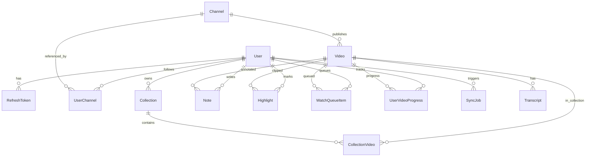

# STEP 2 계획 — 엔티티 후보 도출 및 관계 설계

## 1. 단계 목표

- 유튜브 학습 영상 관리 플랫폼의 **핵심 엔티티 후보**를 도출하고 **ER 수준 연관관계**를 고정한다.
- **사용자별 데이터**와 **공용(참조/캐시) 데이터**를 명확히 구분해 이후 `backend-db-spec.md`(STEP 3)가 흔들리지 않게 한다.
- 조회 패턴·**인덱스 후보**·soft delete 필요 여부를 같은 문맥에서 검토한다.
- **Swagger/API 노출**과 **로그 마스킹** 관점을 엔티티 필드 단위로 표시한다.

## 2. 이번 단계에서 해결할 문제

- 도메인 패키지(`user`, `channel`, `video`, `collection` 등)와 **실제 테이블 책임**이 어긋나는 문제를 사전에 방지한다.
- 동일 YouTube 리소스(채널·영상)를 사용자마다 중복 저장할지, **플랫폼 공용 캐시 + 사용자 연결 테이블**로 나눌지 결정한다.
- “나중에 인덱스”가 아니라 **목록/상세/소유권 검증** 등 주요 조회에 맞춘 인덱스 후보를 문서에 남긴다.

## 3. 설계 대상

| 대상 | 설명 |
|------|------|
| 엔티티 후보 목록 | 계정·인증·채널·영상·컬렉션·노트·하이라이트·자막·시청 큐·진행률·동기화 작업 등 |
| 데이터 분류 | USER_SCOPED / SHARED_REFERENCE / SECURITY 각 엔티티에 태그 |
| 연관관계 | 1:N, N:M(중간 엔티티), FK 방향 |
| 인덱스·유니크 | 자주 쓰는 WHERE·JOIN·ORDER BY 기준 |
| soft delete | 계정·컬렉션 등 복구/감사 필요 여부 |
| API·로그 | Entity 직접 노출 금지 전제 하, DTO 설계 시 참고할 노출/비노출·마스킹 |

## 4. 주요 결정 사항

- **YouTube 채널·영상 메타데이터**는 `youtube_channel_id` / `youtube_video_id` 기준의 **공용 참조 엔티티**(`Channel`, `Video`)로 둔다. 여러 사용자가 같은 영상을 담아도 **Video 행은 단일**을 원칙으로 한다.
- 사용자의 “구독/등록 채널”은 **`UserChannel`** 로 USER_SCOPED 연결을 표현한다.
- 컬렉션-영상은 **`CollectionVideo`** 중간 엔티티로 순서·추가 시각을 관리한다.
- **자막(Transcript)** 은 1차적으로 **영상 단위 공용 저장**(언어별)을 전제로 하되, 향후 사용자 전용 자막이 필요하면 확장(별도 엔티티 또는 플래그)한다.
- **RefreshToken**은 보안상 해시만 저장·로그/Swagger 비노출을 원칙으로 한다.
- **OAuth 연동 토큰**(YouTube Data API용)이 필요해지면 별도 `UserYoutubeCredential`(가칭)로 분리하며, 본 STEP에서는 후보로만 언급 가능.

## 5. 생성/수정 예정 파일

| 파일 | 용도 |
|------|------|
| `docs/backend-step2-plan.md` | 본 문서 |
| `docs/backend-entities.md` | 엔티티별 필드·제약·관계·인덱스·soft delete·API/로그 정책 |
| `docs/backend-step2-result.md` | STEP 2 산출 요약 및 STEP 3 연결 |

## 6. 구현 범위

- 위 문서 3종 작성.
- `backend-entities.md`에 **엔티티 후보 목록**, **관계 다이어그램(텍스트/Mermaid)**, **조회 패턴 → 인덱스 매핑** 요약 포함.

## 7. 제외 범위

- JPA 엔티티 클래스·마이그레이션·Repository 코드 작성.
- 컬럼 길이·DB 제품(MySQL vs PostgreSQL) 최종 확정은 **STEP 3**에서 `backend-db-spec.md`로 구체화.
- API URL·요청/응답 DTO 상세는 `backend-api-spec.md`(후속)에서 다룸.

## 8. 다음 단계 연결 포인트

- **STEP 3**: 본 문서의 필드 타입·`unique`·`index` 후보를 **실제 DDL·제약 이름·옵션**(charset, partial index 등)으로 옮김.
- **STEP 4**: 공통 예외(예: 리소스 없음, 소유권 위반)와 엔티티 수명주기(soft delete 필터) 정책을 맞춤.
- **STEP 5~6**: `User`, `RefreshToken` 등 인증 연계 필드와 Swagger 스키마 분리 원칙 유지.

---

## 부록: 연관관계 초안 (Mermaid)

## 부록: 조회 패턴 → 인덱스 후보 (요약)

| 패턴 | 인덱스 후보 |
|------|----------------|
| 로그인·이메일 중복 검사 | `User.email` UNIQUE |
| 사용자별 채널 목록 | `(user_channel.user_id, user_channel.created_at)` |
| 채널별 영상 목록 | `video.channel_id` + `(channel_id, published_at DESC)` |
| 컬렉션 내 영상 정렬 | `(collection_video.collection_id, collection_video.sort_order)` |
| 사용자 노트/하이라이트 by 영상 | `(note.user_id, note.video_id)`, `(highlight.user_id, highlight.video_id)` |
| 시청 큐 | `(watch_queue_item.user_id, watch_queue_item.sort_order)` |
| 동기화 작업 모니터링 | `(sync_job.status, sync_job.created_at)` |
