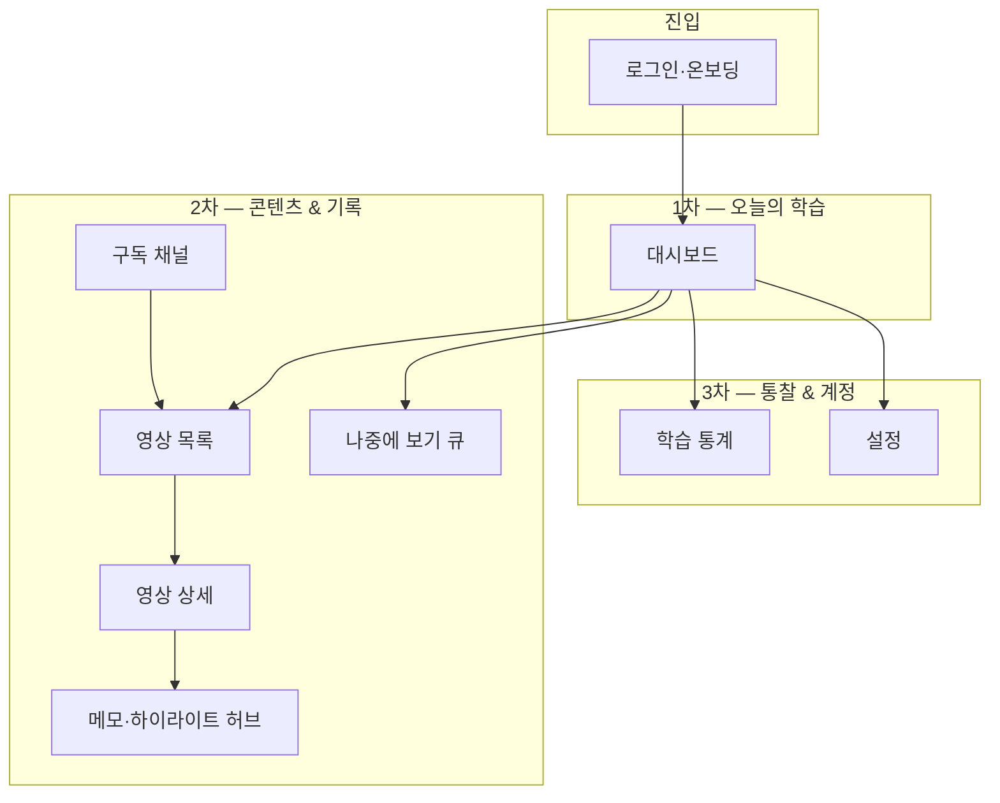

# step1-plan — 프론트엔드 정보구조·레이아웃·UI 시스템 설계

## 1. 단계 목표

- 서비스 전반의 **정보구조(IA)**·**페이지 맵**·**라우트**를 한곳에서 추적 가능하게 정의한다.
- **대시보드 중심**으로 1차 행동(오늘 할 일·이어보기)이 내비게이션과 진입 경로에서 가장 먼저 보이도록 한다.
- **왼쪽 사이드바 기반 생산성 도구형 앱 쉘**을 채택해 유튜브형 소비 UI가 아닌 **학습 관리 도구** 톤을 유지한다.
- **공통 UI 시스템 초안**(컬러·타이포·간격·컴포넌트 역할)을 문서·코드(`tokens.css`)로 고정한다.
- **프로젝트 폴더 구조** 생성, **라우터·플레이스홀더 페이지**까지 1단계 구현을 완료한다.

---

## 2. 이번 단계에서 해결할 사용자 문제

| 사용자 문제 | 설계로 어떻게 해소하는가 |
|-------------|-------------------------|
| “이 앱이 무엇을 위한 공간인지” 한눈에 안 보인다 | 대시보드·영상·메모·큐가 **내비게이션 IA**에 반영되고, 앱 쉘에 **서비스 정체(학습 관리)**가 드러난다 |
| 페이지마다 레이아웃이 달라져 학습 흐름이 끊긴다 | **단일 앱 쉘**(사이드바 + 상단 바 + 콘텐츠)로 고정, 상세·풀스크린 예외만 문서화 |
| 나중에 기능이 늘어나도 찾기 어렵다 | **IA 위계**: **대시보드(허브)** → 2차(영상·큐·메모·채널) → 3차(통계·설정) |

---

## 3. 대상 페이지 / 대상 컴포넌트

### 3.1 전체 페이지 IA (정보구조)



**IA 위계 요약**

| 층 | 역할 | 포함 라우트(개념) |
|----|------|-------------------|
| 1차 | 오늘 할 일, 이어보기, 상태 한눈에 | 대시보드 |
| 2차 | 영상·스크립트·메모·큐·채널 정리 | 영상 목록/상세, 메모 허브, 나중에 보기, 구독 |
| 3차 | 패턴 파악, 환경 설정 | 통계, 설정 |
| 진입 | 계정/세션(추후) | 인증 |

**페이지별 1·2차 핵심 행동·상태 인지 (요약)**

| 페이지 | 1차 핵심 행동 | 2차 보조 행동 | 상태 인지 |
|--------|---------------|---------------|-----------|
| 대시보드 | 이어보기 / 오늘 큐에서 영상 열기 | 통계·설정으로 이동 | 진행 중·완료·대기 건수 |
| 영상 목록 | 필터로 학습 상태별 탐색 | 검색·정렬 | 현재 필터·개수 |
| 영상 상세 | 재생 위치·스크립트·메모 연동 학습 | 상태 변경·채널 이동 | 시청 진행률·메모 수 |
| 메모 허브 | 타임라인 메모 검색·필터 | 영상으로 점프 | 필터·빈 목록 |
| 나중에 보기 | 큐 순서 조정·다음 재생 선택 | 영상 상세로 이동 | 큐 길이 |
| 구독 채널 | 채널별 영상 흐름 파악 | 채널 필터로 목록 이동 | 구독 수 |
| 통계 | 기간·지표 확인 | 대시보드 복귀 | 기간·데이터 유무 |
| 설정 | 테마·알림·연동(추후) | — | 저장 상태 |

상세 UX 검토 문구는 `docs/ui-decisions.md`의 학습 UX 원칙과 함께 유지한다.

### 3.2 1단계에서 다루는 컴포넌트(설계·구현)

- **레이아웃**: `AppShell`, `AppSidebar`, `AppHeader`, `MainContent`, `PageHeader`
- **페이지 조합**: `PagePlaceholder`(제목·설명·향후 기능 bullet)
- **앱 진입**: `AppProviders`, `AppRouter`(또는 `router.tsx`의 `createBrowserRouter` 설정)
- **공통 UI(초안)**: `Button`/`Card`/`Badge`/`EmptyState`는 **2단계**에서 구현(문서만 1단계)

---

## 4. 화면 구성 요소

### 4.1 앱 쉘·레이아웃 전략

**톤**: 생산성 도구(노션/Linear류)에 가깝게 — **고정 사이드바 + 얇은 상단 바 + 본문**, 강한 썸네일 그리드 중심이 아님.

**레이아웃 패턴 (1단계 구현)**

| 영역 | 역할 | 1단계 |
|------|------|--------|
| **AppSidebar** | IA 그룹별 글로벌 내비, 현재 경로 표시 | 구현 |
| **AppHeader** | 서비스 정체 문구, 전역 검색 자리(비활성 플레이스홀더), 사용자 영역 자리 | 구현 |
| **MainContent** | `PageHeader` + 스크롤 가능 본문, `max-width`로 읽기 폭 제한 | 구현 |
| **보조 패널(Aside)** | 영상 상세에서 스크립트·메모 **우측 고정** 등 | **1단계에서는 미구현**. 동일 앱 쉘 안 단일 컬럼만 두고, step2에서 `VideoDetail` 레이아웃 그리드(메인 + aside)로 확장 |

```
┌──────────────────────────────────────────────────────────────┐
│ AppHeader   [브랜딩 · 학습 관리]    [검색 자리]     [사용자 자리]   │
├─────────────┬────────────────────────────────────────────────┤
│ AppSidebar  │ PageHeader (제목·한 줄 설명·옵션 액션)            │
│ · 대시보드   │────────────────────────────────────────────│
│ · 학습 그룹  │ MainContent (placeholder / 이후 실 콘텐츠)       │
│ · 채널·통계  │  (향후 영상 상세: 본문 좌 + 보조 패널 우)        │
│ · 설정      │                                                │
└─────────────┴────────────────────────────────────────────────┘
```

**사이드바 내비게이션 그룹 (대시보드 허브 + IA)**

1. **오늘** — 대시보드(기본 진입 `/` → `/dashboard`)  
2. **학습** — 영상, 나중에 보기, 메모  
3. **채널** — 구독 채널  
4. **인사이트** — 통계  
5. **계정** — 설정  

**영상 상세**: 목표는 **학습 패널형**(플레이어 + 스크립트·메모). 보조 패널은 **2단계**에서 도입하고, 1단계는 플레이스홀더만 동일 앱 쉘에 둔다.

**반응형**: 1단계는 데스크톱 우선(사이드바 고정 폭). 좁은 뷰포트는 추후 드로어로 이전.

### 4.2 공통 UI 시스템과의 연결

- 색·글꼴·간격·카드·버튼·상태 배지 규칙은 `docs/ui-decisions.md`를 단일 소스로 한다.
- 구현 시 CSS 변수 또는 디자인 토큰 파일(`src/shared/styles/` 등)로 옮긴다.

---

## 5. 상태 및 데이터 구조

본 단계는 **코드 구현 전**이므로 데이터는 **개념 스키마**만 둔다. (mock/API는 2단계 이후 구체화.)

| 도메인 | 개념 엔티티 | 비고 |
|--------|-------------|------|
| 영상 | `Video`, `WatchProgress`, `LearningStatus` | 유튜브 메타 + 학습 상태 |
| 채널 | `Channel` | 구독 단위 |
| 메모 | `Note`, `Highlight` | 타임코드 기준 |
| 큐 | `WatchLaterItem` | 순서·우선순위 |
| 사용자 | `User`, `Preferences` | 설정·온 |

전역 클라이언트 상태(예: React Query + Context)는 **1단계 구현에서 도입하지 않음**. 라우트·레이아웃만 우선.

---

## 6. UX 결정 사항

- **3초 규칙**: 각 페이지 플레이스홀더에도 **페이지 제목 + 한 줄 설명**을 넣어 목적이 즉시 이해되게 한다.
- **유튜브 복제 금지**: 썸네일 그리드만 강조하지 않고 **상태·진도·다음 액션**이 보이는 카드/리스트 톤을 기본으로 한다.
- **학습 흐름**: 영상 상세에서 스크립트·메모 영역이 **동일 앱 쉘** 안에서 전환되도록(별도 팝업 최소화) 설계한다.
- **접근성**: 포커스 이동 순서는 사이드바 → 본문; 향후 키보드 단축키는 영상 상세 중심으로 확장.

---

## 7. 구현 범위 (1단계)

1. **문서**: `step1-plan`, `routes`, `components`, `ui-decisions` 유지·보강, 완료 후 **`step1-result.md`**.  
2. **빌드 도구**: Vite + React 18 + TypeScript.  
3. **라우팅**: React Router v6, `docs/routes.md`와 동일한 경로 골격 + 앱 쉘 레이아웃 라우트.  
4. **앱 쉘**: `AppShell` + 사이드바 + 헤더 + `Outlet` 기반 메인 영역.  
5. **페이지**: 로그인(쉘 외) 및 앱 쉘 내 전 페이지 **플레이스홀더**.  
6. **스타일**: `src/shared/styles/tokens.css`·`global.css`로 `ui-decisions` 토큰 반영.  
7. **폴더**: 부록 A 구조에 맞게 디렉터리 생성(빈 `features/`·`entities/` 등은 `.gitkeep` 또는 최소 파일로 유지).

---

## 8. 제외 범위

- 실제 YouTube API·OAuth 연동  
- mock 데이터 대량 작성·상세 CRUD UI  
- 영상 플레이어·스크립트 싱크·메모 에디터 본구현  
- 테스트·E2E·스토리북  
- 다국어·서버 사이드 렌더링  

---

## 부록 A. 프로젝트 폴더 구조 제안

저장소 루트 기준. **`docs/`는 루트에 둔다**(프로젝트 규칙 `stepN-plan` 경로와 일치).

```
youtube/
  docs/                    # 기획·단계 문서 (현재 위치)
  public/
  src/
    app/
      router/              # 라우트 정의·레이아웃 라우트
      providers/           # (선택) Router, 향후 QueryClient
    pages/                 # 라우트 1:1 페이지(조합 위주)
      auth/
      dashboard/
      videos/
      video-detail/
      subscriptions/
      watch-later/
      notes/
      analytics/
      settings/
    components/
      common/
      layout/              # AppShell, Sidebar, Header
      dashboard/
      video/
      channel/
      notes/
      analytics/
    features/              # 단계별로 도메인 UI·훅 증가
      video-management/
      note-management/
      subscription-management/
      watch-later-management/
      learning-analytics/
    entities/              # 도메인 단위 타입·mapper(얇게 시작)
      video/
      channel/
      note/
      user/
    shared/
      ui/                  # Button, Card, Badge…
      lib/
      hooks/
      utils/
      constants/
      styles/              # tokens.css, global.css
      types/
    services/              # API 클라이언트 (추후)
    mocks/                 # mock 데이터 (추후)
  index.html
  package.json
  tsconfig.json
  vite.config.ts
```

**분리 원칙**: 페이지는 조합, 비즈니스 UI는 `features/`, 재사용 primitives는 `shared/ui/`, 라우팅만 `app/router/`.

---

## 부록 B. 다음 단계 TODO (step2 예고)

- 영상 상세 **보조 패널**(스크립트·메모) 레이아웃 그리드  
- mock 타입·`mocks/` 초기 세트·대시보드 카드 목업  
- 공통 `Button`/`Card`/`Badge`/`EmptyState` 구현 및 `ui-decisions`와 동기화  
